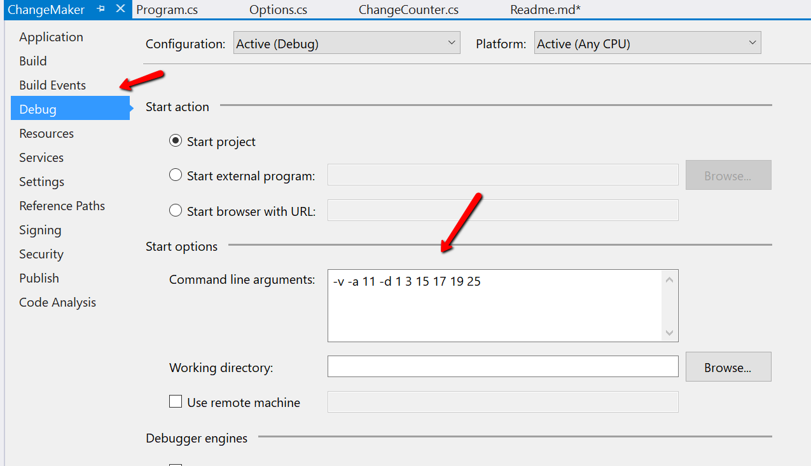
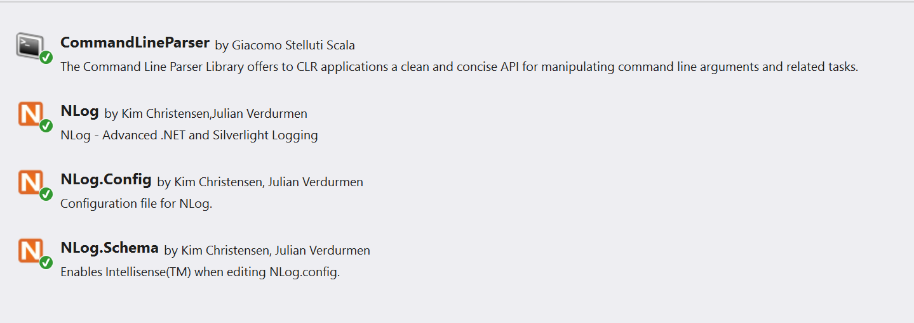

# ChangeMaker

## Purpose
This application was done as part of an interview process for a new job. The test was to create a small application that would count the different ways that change could be made for any given amount with a given set of denominations. *Then explain how to use the program.*

This application, and this readme.md file accomplish both parts of the test. I actually put them up here on GitHub as an easy way to allow the interviewer/reviewer to access the code. Anyone else is also free to use it for whatever legal purpose they may have.

## How to build the application
First, download the solution files or pull from the repository.

Note that I've used a couple of NuGet packages which were not checked in, so do a restore of NuGet packages.

Build it. It is created using VS 2017 Community Edition, so should work for most of the Visual Studio versions out in the wild.

## How to run the application
This application accepts 3 parameters:
* -v mere presence indicates a log file should be created. It is created in a /logs sub-directory found under the same directory from which the application is run.
* -a the actual amount for which change is being counted. A positive integer number is expected.

* -d a space-separated list of integer denominations to be assumed available for making change

There is no specific order of entry of these parameters thanks to one of the NuGet packages I found & used (more about this below).
There is no checking that the denominations are real currency values - any space-separated list of positive whole integers will do, e.g. 2 3 7 15 will work. However, 1.5, 3, 9 will not. It does not blow up gracefully, however. More about that below.

As example, to calculate how many ways 97 can e constructed using the denominations of 2, 3, 7, 15:

```ChangeMaker.exe -v -a 97 -d 2 3 7 15```

Note that you can enter these parameters into the command line arguments window of the Debug tab of the program properies editor:


This will give you an easy way to run the application in debug from within VS.

## How it works
The application relies on recursion and 3 integer arrays:
*  ```int[] denomArray;``` holds a list of entered denominations sorted in descending order
* ```int[] maxCoeffArray;``` holds a list of the maximum coefficients for each denomination in denomArray. If a denomination has a value of 1, the maximum is set to 1 (more about this below)
* ```int[] currCoeffArray;``` holds a transitory list of the current coefficients for  each domination as the program iterates.

As example, for
```ChangeMaker.exe -a 27 -d 1 5 20 30``` 
* the denomArray values will be [30, 20, 5, 1]  
* the maxCoeffArray values will be [0, 1, 5, 1]  
* As the arrays are iterated through recursively the currCoeffAray will progress from [0,0,0,0] => [0,0,0,1] => [0,0,1,0] => [0,0,1,1] => ... [0, 1, 5, 1]. Yes, this is inefficient. Again, more about this below.

## NuGet packages used
Here's my NuGet list for this:


* NLog: I use NLog for almost EVERYTHING. In this application, NLog is configured programmatically. I know Log4Net is popular, but it went fallow for many years, apparently/possibly due to some licensing issue. So I use NLog. It's actively supported and there are extended targets that allow you to log to external services, such as Application Insights, LogMe, etc. It also has a fulsome list of layout renderers and is thread safe.
* CommandLineParser: I don't normally do console applications. If I want to write some test code, I'll use [LinqPad](http://www.linqpad.net/). It allows you to write test code using LINQ, but doesn't require you to use LINQ. For this, however, I couldn't rely on my audience having LinqPad, so I wrote a console app. I needed to parse argumments so I found a package that sort of works (more below). 

## The "more below" section
### Truncating the "1's" denomination coefficient and sorting the denominations
Let's take the example of amount = 27 and denominations are [5,1]. The maxCoeffArray, without truncation would be [5, 27]. The currCoeffArray will go through the following transitions:
* [0,0] total =  0
* [0,1] total = 1
* [0,2] total = 2
* ...
* [0,27 total = 27
* [1,0] total =  0
* [1,1] total = 1
* [1,2] total = 2
* ...
* [1,22] total = 27
* [1,23] total = 28
* ...
* [5,0] total = 25
* [5,1] total = 26
* [5,2] total = 27
* ...
* [5,27] total = 52

The curious thing is:
if the current total is less than the amount of change required, then when iterating through the 1's denomination, 1 and only 1 answer will ALWAYS be found. So we don't have to iterate through all the possible coefficients of the 1's denomination. We only have to check:

	If the 1's index = 0 and the total = the amount, we have a match so increment the count
	If the 1's index = 1, and the total < the amount eventually we will have a match so just increment the count and be done with the 1's.

The simplest way to do this is to truncate the maxCoeffArray values for the 1's denomination

## Why arrays?
Two reasons.  
First, part of the test is to see how I think about data structures. There are some other answers using combinatorics (according to my limited research). However, those seemed more like Math solutions rather than data structure solutions. Besides, if you want math solutions, MathLab is a better approach.
Second, it needed to be completed quickly - but not necessarily be efficient. This is, after all, just a test - not production code. A timely solution seemed to be a better trade-off to production level code. Hence, also no effort in a Unit Test project. I can add that later, but it's not required for the "test".

## Caveats
The Command Line parser tool I selected seemed to fail to correctly validate the command line parameters, even though it parsed them correctly. Again, due to time restrictions, no parameter value checking is done. If you enter a negative number for one or more of the denominations, the application may end up consuming your computer and spitting it out as a silicon hairball. Caveat Emptor as the un-regulated Romans used to say ...

## What I'd do different/better in the next round
* Validation: no sense letting a simple data entry error eat your computer
* Truncate the recursion by checking the total at every level. One of the advantages of sorting the array in the manner I did, means I can stop interating on an index once I get a total greater than the amount desired. The reason I didn't is again, time. Not so much coding time, but testing time. I also had to write the documentation and that also takes a while. It's not just a coding test ...
*  Read more about the combinatorics and actually implement a Math solution.
*  Add an ability to add change for denominations that are not whole numbers - thus coins - and amounts that are not whole numbers. In other words, generalize it.
* Unit Tests ('nuff said)


 